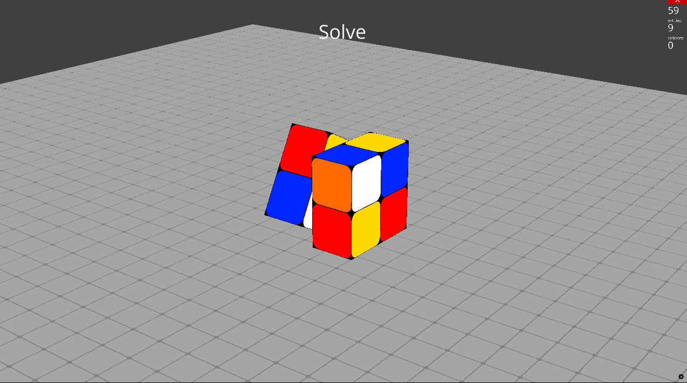

# Rubik's Cube Solver 2x2

This repository contains a Rubik's Cube solver implementation for a 2x2 cube, based on the paper [**_"Solving the Rubik’s Cube with Deep Reinforcement Learning and Search"_**](https://cse.sc.edu/~foresta/assets/files/SolvingTheRubiksCubeWithDeepReinforcementLearningAndSearch_Final.pdf) by **Agostinelli et al**. The project implements several search techniques, including the paper's approach, to find efficient solutions to scrambled cubes.

## Search Techniques Implemented

This repository offers a range of search algorithms to solve the 2x2 Rubik's Cube, each using the Manhattan distance of cube pieces as a heuristic where applicable. The following techniques are available:

- **DeepCubeA**: A deep reinforcement learning approach with search.
- **BFS** (Breadth-First Search)
- **DLS** (Depth-Limited Search)
- **IDS** (Iterative Deepening Search)
- **BiBFS** (Bidirectional Breadth-First Search)
- **A*** (A-Star Search with heuristic)

## Getting Started

### Prerequisites

Ensure that you have Python installed and any dependencies listed in the `requirements.txt` file.

### Running a Method

To solve a cube with a specific method, use the following command:

```bash
python main.py --testcase [testcase_path] --method [method_name]
```

#### Example

```bash
python main.py --testcase testcases/1.txt --method BiBFS
```

### Training the Paper Approach

To train the model based on the paper's technique, run the `train.py` script:

```bash
python train.py
```

#### Additional Training Options

- **Resume Training**: Use the `--resume` flag to continue training from the last checkpoint.
- **TensorBoard Visualization**: Use the `--tensorboard` flag to visualize training stats.

### UI

You can see an example of the UI running in the following image:



## Technical Details

For further technical details on the DeepCubeA, please refer to the original [paper](https://cse.sc.edu/~foresta/assets/files/SolvingTheRubiksCubeWithDeepReinforcementLearningAndSearch_Final.pdf).
